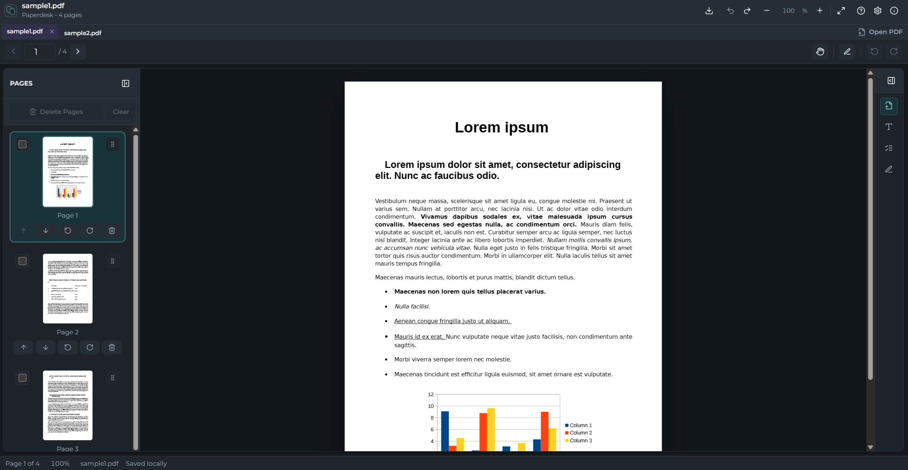

# Paperdesk

Paperdesk is an offline-first desktop PDF workspace for macOS and Windows, built with Tauri, React, TypeScript, PDF.js, and pdf-lib.

The app is designed for local page-level PDF workflows. It does not upload PDFs anywhere, does not include OCR, and does not attempt full automatic reflow or direct editing of existing paragraph text.



## Tech Stack

- Tauri 2 desktop shell
- Vite + React + TypeScript UI
- PDF.js for PDF rendering and thumbnails
- pdf-lib for PDF exporting and page-level output operations
- ESLint and Prettier for project hygiene

## Features

- Open local PDFs without uploading or syncing files.
- Open supported password-protected PDFs with session-only passwords.
- Merge multiple PDFs into one editable workspace.
- Open a scrollable four-column thumbnail overview for each PDF workspace, with source filenames and bookmark markers.
- Bookmark workspace pages and jump back to them from the sidebar.
- Select, delete, rearrange, and rotate pages before export.
- Add page numbers, headers, footers, and watermarks.
- Fill supported PDF form fields and optionally flatten them on export.
- Add exportable text, highlight, shape, pen, and signature annotations.
- Undo and redo major workspace edits.
- Export the final edited workspace as a new local PDF.
- Save unlocked copies or create password-protected AES-256 copies.

## Usage Guide

For a user-facing feature directory, see [guide/README.md](guide/README.md).

1. Start Paperdesk and choose **Merge PDFs** or **Open**.
2. Select one or more local PDF files. Paperdesk loads them into one offline workspace.
3. Use the left sidebar to manage pages, or choose **Page overview** beside the viewer page controls to scan four large thumbnails per row and see bookmarked pages at a glance.
4. Use **Formatter** to add page numbers, headers, footers, watermarks, crop margins, or inserted pages.
5. Use **Forms** to fill supported fields when a PDF includes AcroForm fields.
6. Use **Annotations** and the annotation toolbar to add notes, text, highlights, shapes, pen marks, or signatures.
7. Use **Export** to save a new final PDF. The original source PDFs are left unchanged unless you explicitly confirm overwriting one of them.
8. Use **Protection** in the Document panel to save a locked or unlocked copy. Exports from protected workspaces ask whether to keep protection.

## Requirements

- Node.js 18 or newer
- Rust 1.85 or newer and Cargo
- Tauri platform prerequisites for your OS

For desktop bundles:

- macOS builds are produced on macOS.
- Windows builds are produced on Windows.

## Install

```bash
npm install
```

## Development

Run the full Tauri desktop app:

```bash
npm run dev
```

The raw Tauri command is also available through npm argument forwarding:

```bash
npm run tauri dev
```

Run only the Vite frontend:

```bash
npm run dev:vite
```

## Checks

```bash
npm run lint
npm run typecheck
npm run format
npm run test
```

## Build

Build the desktop app for the current platform:

```bash
npm run build
```

The raw Tauri build command is also available through npm argument forwarding:

```bash
npm run tauri build
```

Build only the frontend assets:

```bash
npm run build:vite
```

The base Tauri bundle configuration is portable, with platform-specific overrides in `src-tauri/tauri.macos.conf.json` and `src-tauri/tauri.windows.conf.json`. macOS is configured for `app` and `dmg`; Windows is configured for `msi` and NSIS `.exe`. App metadata is configured as:

- Product name: Paperdesk
- Version: 0.1.1
- Bundle identifier: `com.paperdesk.app`
- Icon placeholders: `src-tauri/icons/`

### macOS

macOS desktop bundles must be built on macOS with Apple command line tools installed.

```bash
npm install
npm run test
npm run build
```

Expected outputs are under `src-tauri/target/release/bundle/`, including the `.app` bundle and `.dmg` image when supported by the installed Tauri toolchain. Replace the placeholder icons in `src-tauri/icons/` before signing, notarizing, or publishing a public release.

### Windows

Windows desktop bundles must be built on Windows with the Tauri Windows prerequisites installed, including WebView2 support and the required Microsoft build tools. The default Windows build is unsigned for local development; use the signed build script for release installers.

```powershell
npm install
npm run test
npm run build
```

Expected outputs are under `src-tauri\target\release\bundle\`, including `.msi` and NSIS `.exe` installers where supported by the installed Tauri toolchain. Replace the placeholder icons in `src-tauri\icons\` before signing or publishing a public release.

Use a trusted Windows code-signing certificate for release builds. A self-signed certificate can be useful for local testing, but it will not remove SmartScreen or publisher warnings for other people unless their machine trusts that certificate.

Configure one of these certificate sources before building:

```powershell
# Certificate already installed in the Windows certificate store.
$env:PAPERDESK_SIGN_CERT_SHA1 = "YOUR_CERTIFICATE_SHA1_THUMBPRINT"
```

```powershell
# PFX certificate file.
$env:PAPERDESK_SIGN_CERT_PATH = "C:\path\to\certificate.pfx"
$env:PAPERDESK_SIGN_CERT_PASSWORD = "certificate-password"
```

Optional overrides:

```powershell
$env:PAPERDESK_TIMESTAMP_URL = "http://timestamp.digicert.com"
$env:PAPERDESK_SIGNTOOL_PATH = "C:\Program Files (x86)\Windows Kits\10\bin\<version>\x64\signtool.exe"
```

Build signed Windows installers:

```powershell
npm run build:windows:signed
```

The signing script uses `signtool.exe` from the Windows SDK and signs with SHA-256 plus a timestamp, so the installer signature can remain valid after the certificate expires.

## Known Limitations

- No OCR. Scanned/image-only PDFs are not converted into searchable or editable text.
- No automatic paragraph reflow. Paperdesk focuses on page-level editing, overlays, forms, and export.
- Some legacy or nonstandard PDF encryption schemes are unsupported.
- Some advanced PDF form field types may be unsupported and left unchanged.

## Privacy

Paperdesk is designed to keep PDF work local to your device.

- All PDF processing is local.
- No files are uploaded.
- No OCR is performed.
- No cloud sync is built in.
- Recent files and autosave metadata can be disabled in Settings.
- Autosave may keep local recovery copies of unprotected sources; it never caches decrypted protected sources.
- Passwords and decrypted bytes from protected sources are kept in memory only and are not written to autosave storage.

## Merge Workflow

Paperdesk treats merging as an editable workspace, not a one-shot merge-and-save operation.

- Use **Merge PDFs** to select multiple local PDF files at once.
- Each selected PDF is loaded locally through Tauri filesystem APIs.
- Paperdesk creates one `PdfWorkspace` containing all non-deleted pages from all selected PDFs.
- Pages are appended in the selection order returned by the file picker.
- Each page keeps its `sourceDocumentId`, `sourceFileName`, original `sourcePageIndex`, and current `displayIndex`.
- The left sidebar renders thumbnails for the merged page board and shows source labels when multiple PDFs are present.
- The viewer toolbar opens a four-column overview for the active workspace. Select a thumbnail to jump to it, or use the bookmark badge on a thumbnail to save or remove that page.
- The center viewer immediately renders the first page.
- The right tools panel lists source files, total source page count, and currently included page count.
- Use **Add more PDFs** in the right panel to append additional PDFs into the same workspace.
- Page board controls support selecting, deleting, drag-and-drop rearranging, moving with buttons, and rotating selected pages left or right before any export step.
- Deleting, rearranging, and rotating pages are non-destructive: source PDF bytes remain unchanged and page operations can be restored with Undo.
- Drag one thumbnail to rearrange a page, or drag any selected thumbnail to move the selected pages as a group. Delete or Backspace deletes selected pages, Escape clears selection, and Cmd/Ctrl+A selects all pages when the thumbnail sidebar is focused.
- Use **Export PDF** to save the current workspace as a new local PDF. Export respects merged sources, current page order, deleted pages, and rotations.
- If the selected export path matches an original source PDF, Paperdesk asks for explicit confirmation before overwriting it.

The original PDF bytes remain unchanged. Workspace edits are represented as page-level metadata until export writes a new local PDF.

## Current Scope

Local single-PDF opening, multi-PDF merge workspaces, PDF.js page rendering, thumbnails, page navigation, zoom controls, source tracking, multi-page selection, undo/redo, page deletion, rearranging, rotation, form edits, annotations, overlay formatting, metadata-only local autosave recovery, and final PDF export are wired.

## Contributing

Contributions are welcome. See [CONTRIBUTING.md](CONTRIBUTING.md) for the development workflow and checks to run before opening a pull request.

Please report security issues privately as described in [SECURITY.md](SECURITY.md).

## License

Paperdesk is released under the [MIT License](LICENSE). Bundled fonts remain under their respective SIL Open Font License files in [`src/assets/fonts`](src/assets/fonts).
